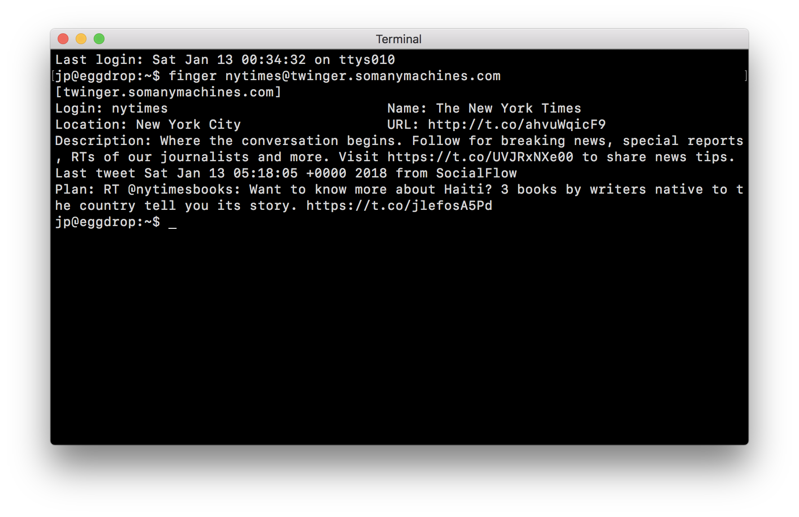

# Twinger

This is a small demo application for the [fargate CLI][fargate-cli]. It
demonstrates building a network load balancer and deploying a TCP service.

The application is a daemon that speaks a subset of the [finger user information protocol][finger-rfc]
and returns information about Twitter users.



# Deploy

1. **Clone the repo**

    ```console
    git clone https://github.com/jpignata/twinger.git
    ```

1. **Create the load balancer**

    ```console
    fargate lb create twinger --port 79
    ```

1. **Create and deploy the service**

    ```console
    fargate service create twinger --lb twinger --port 79 \
      --env CONSUMER_KEY=yourconsumerkey \
      --env CONSUMER_SECRET=yourconsumersecret \
      --env ACCESS_TOKEN=youraccesstoken \
      --env ACCESS_TOKEN_SECRET=youraccesstokensecret
    ```

1. **Get the DNSName of the load balancer**

    ```console
    fargate lb info twinger
    ```

1. **Test**

    ```console
    finger nytimes@DNSName
    ```

[finger-rfc]: https://tools.ietf.org/html/rfc1288
[fargate-cli]: https://github.com/jpignata/fargate
